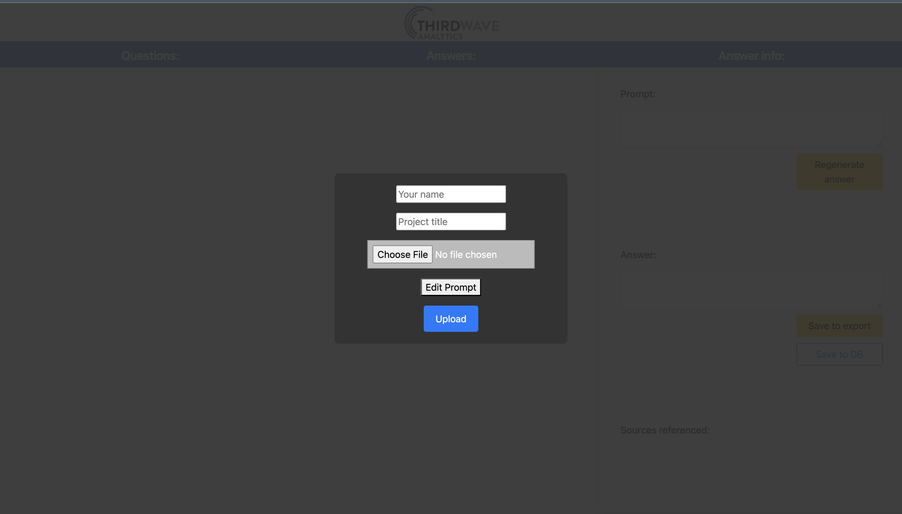
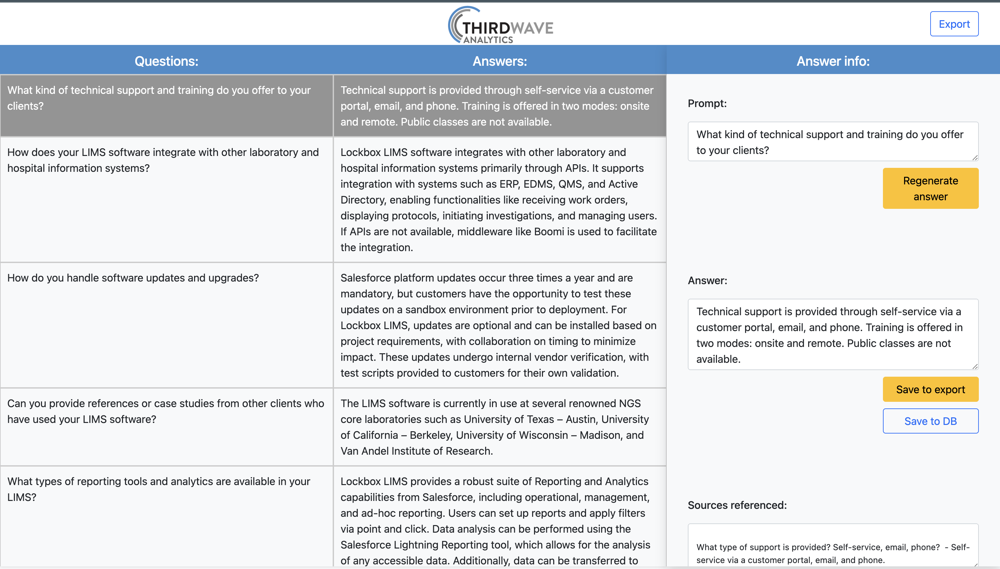
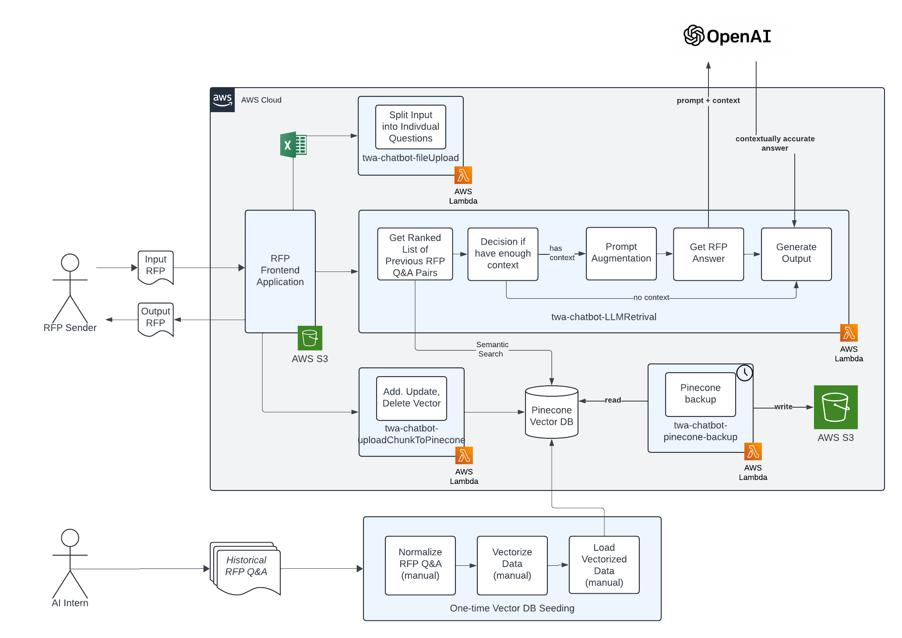

# TWA RFP Chatbot

A tool for the sales team to utilize that assists with the completion of RFP vendor questionnaires.

https://d318fvq3xvqnjg.cloudfront.net/

*Username*: twa  
*Password*: chatbot

## Demo

## Project Overview

This project relies on three main technologies:

- [AWS](https://aws.amazon.com/console/) hosts project in the cloud
  - AWS S3 hosts website and pinecone backups
  - AWS Lambda hosts multiple api scripts
- [Pinecone DB](https://www.pinecone.io/) to store question and answer pairs from previously filled out RFP vendor questionnaires.
- [OpenAI API](https://platform.openai.com/docs/overview) for llm calls. 

---

## Project Layout

**The project code is broken into three main folders:**

### 1.) Website

Includes website code, example test spreasheets, and a website buildscript.

*Build script*: deploys the code to AWS. The website code is stored in the S3 bucket labeled `twa-chatbot-chatbot-software` and is delivered through a cloudFront distribution with the id `EPJ8Y9J7TDY16`.

*Website code*: the code is basic HTML, CSS, and JavaScript. The only lambda API calls that occur are in:

   - **uploadinitialization.js**: includes call to `twa-chatbot-fileUpload`
   - **retrieveLLMAnswer.js**: includes call to `twa-chatbot-LLMRetrieval`
   - **pineconeFetches.js**: includes call to `twa-chatbot-uploadChunkToPinecone`

### 2.) Lambda

Includes a folder of lambda buildscripts, and a directory including the four AWS lambda functions. 

Each lambda function subfolder includes a `lambda_function.py` which is the python script deployed to AWS, and a buildscript that deploys `lambda_function.py` to AWS

  - **twa-chatbot-LLMRetrieval**: The core logic behind retrieving answers. A RAG LLM script that utilizes pineconedb and openAI to get contextually accurate LLM answers. Connected to the `/query` endpoint in API gateway. Feautures:
      - can switch out the openAI model used 
      - uses hyde technique

  - **twa-chatbot-pinecone-backup**: Scheduled with Amazon EventBridge to run once a week. Creates a backup in s3 bucket named `twa-chatbot-pinecone-backups`. Can utilize `pineconeBackupUpload.py` to upload one of the save files.

  - **twa-chatbot-uploadChunkToPinecone**: This script is utilized by the frontend to handle all pinecone index manipulations such as `adding`, `editing`, or `deleting` a vector from the database. Connected to the `/uploadPineconeEmbedding` endpoint in API gateway.

  - **twa-chatbot-fileUpload**: The lambda script that takes in the initially uploaded excel file on the website and returns a list of questions (which are taken from the first row of the excel spreadsheet). Connected to the `/sendFile` endpoint in API gateway.

### 3.) Vector DB
This directory includes a folder of cleanedUpData which contains cleaned up text versions of all the previous RFP questionaires. These are a text format of question answer pairs each seperated by a backslash.

It also contains a folder of useful scripts for the Pinecone database. Run `pip install -r requirements.txt` in the directory to install dependencies for all the scripts:

  - **createAndUploadEmbeddings.py**: Goes to the cleanedUpData directory and seperates each of the individual Q&A pairs by backslash, embeds each of them using `text-embedding-ada-002`, and uploads them to the pinecone index `twa-chabot2`

  - **pineconeBackupUpload**: Given a downloaded pinecone database backup found in `twa-chatbot-pinecone-backups` in AWS S3 - reinstantiates it into a given pinecone index.

## Project Runbook

### Prerequisites

- Ensure that you have the following tools installed:
  - AWS CLI
  - Python (version 3.11)

### Website is broken/giving error messages

Go to `AWS Cloudwatch` for log files on different lambda functions. Odds are something is wrong in the `twa-chatbot-LLMRetrieval` script since it relies on many different services - so start on the most recent log file from that function.

### How to switch openai model
Go into `twa-chatbot-LLMRetrieval` and switch the model in the code to one of the available ones on https://platform.openai.com/docs/models

### How to roll back the database
Download a timestamped backup out of the `twa-chatbot-pinecone-backups` S3 bucket. Download it into the `Vector DB` scripts directory and run `pineconeBackupUpload.py` after editing the script to have the correct pinecone index and backup reference.

